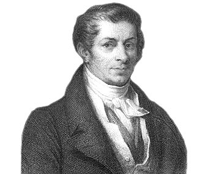
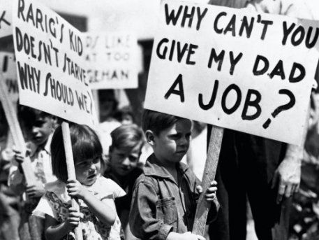
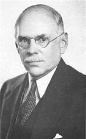
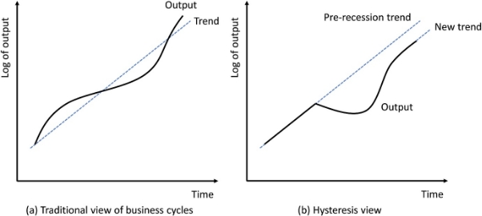

**Principles of Macroeconomics Lecture Notes – Spring 2021			Prof. Juan Sapena**

**Lecture 1. What is macroeconomics**

Macroeconomics studies **economic aggregates**, considered as objectives, or measures of performance. Macroeconomics, by its very nature, involves aggregation.

- **Aggregate value produced** per unit of time, such as the Gross Domestic Product (GDP)
- **Unemployment** (and its rate) of individuals supplying their labor services to be used for production purposes. 
- At a “macro-level” we also pay attention to the evolution of **aggregate price level**; whose trajectory reflects a sort of “aggregate-disequilibrium”. Instead of relative prices, now we focus on price indexes (GDP deflator or CPI index are two examples).
- **Interest rate**, as an index of the time preference when making choices that involve intertemporal substitution.
- **Exchange rates** measuring the value of one country's currency in relation to another currency.

The macroeconomic approach considers the outcomes (for example, in terms of the above elements) resulting from the meeting of two “vector” forces: 

- Aggregate Demand (AD), and
- Aggregate Supply (AS).

For centuries, classic economics highlighted the importance and constraints imposed by supply issues (resources and technology):

*Say’s Law: “supply creates its own demand”. Also known as the or the law of markets, claimed that the production of a product creates demand for another product by providing something of value which can be exchanged for that other product.*

Say’s law got its name from the French economist and businessman Jean-Baptiste Say (1767 -1832)

Hence, until the Great Depression of the 1930s, economics was economics—the study of how human societies organize the production, distribution, and consumption of goods and services. 

Notwithstanding, the severe and prolonged global collapse in economic activity that occurred during the Great Depression changed that, giving birth to macroeconomics and macroeconomics policies. 

So, since its inception, macroeconomics introduced the relevance of the need to pay attention to the short-run evolution of **aggregate demand** and its influence on aggregate production and unemployment.:

This cartoon illustrates the preeminence of aggregate demand (AD) and its potential impact (negative or positive) on production and employment:

John Maynard Keynes (1886-1946), in particular in his book *The General Theory of Employment, Interest and Money* (1936) introduced the simultaneous consideration of equilibrium in three interrelated sets of markets—for goods, labor, and finance. 

The three groups of macroeconomic markets that form the foundation of macroeconomy are: 

- product markets, 
- financial markets, and
- resource markets. 

Each set of markets exchange a different type of commodity important to the economy.

- The product markets exchange final goods and services, or gross domestic product.
- The financial markets exchange legal claims, or financial instruments. 
- The resource markets exchange factor services, or the services of the four factors of production--labor, capital, land, and entrepreneurship.

Each of the three groups of macroeconomic markets are commonly aggregated into theoretical constructs that combine the activity in hundreds of thousands of individual microeconomic markets. These three aggregated macroeconomic markets are characterized by the basic types of commodities exchanged.

The four macroeconomic sectors--household, business, government, and foreign--interact through these three sets of markets. The primary objective of macroeconomic theories is to explain activity that takes place in these three sets of markets.

The four macroeconomic sectors take part in each of the three sets of markets in various ways. Consider which sectors are the primary buyers and sellers for each market.

- Household Sector: The household sector is the primary participant on the buying side of the product markets. This sector regularly purchases almost two-thirds of all gross domestic product exchanged through the product markets. This sector, in that it owns all resources, is also on the selling side of the resource markets. In fact, the income that it uses to purchase gross domestic product comes from selling factor services through the resource markets. Lastly, the household sector is on the buying side of the financial markets. When it buys legal claims, it is lending (or saving) income.
- **Business Sector:** The business sector is THE primary participant on the selling side of the product markets. This is the sector responsible for production. However, it also purchases capital goods through the product markets, meaning it operates on both the selling side and the buying side. This sector is also on the buying side of the resource markets. It acquires the factor services used for production from the household sector through the resource markets. Lastly, the business sector is largely on the selling side of the financial markets. When it sells legal claims, it is borrowing income that is more often than not used to purchase capital goods.
- **Government Sector**: The government sector participants on the buying side of the product markets along with the household and business sector. The government acquires a portion of gross domestic product in the course of pursuing its designated functions. This sector also surfaces on the selling side of the financial markets. If often sells legal claims to raise funds needed to pay for the purchase of gross domestic product.
- **Foreign Sector:** The foreign sector participants in the product markets, on both the buying side and the selling side. When goods are exported from the domestic economy, the foreign sector is on the buying side of the product markets. When goods are imported into the domestic economy, the foreign sector is on the selling side of the product markets.
- **Financial Sector.**

Keynes stated the need **of stabilizing the business cycle**, as “in the long-run we are all dead”, while, in the short run, “animal-spirits” can lead to aggregate fall in the real value created and distributed, as a rise in unemployment rates, excluding a part of the society from “enjoying a part of the fruits produced”. 

According to Keynes (and others) as human behavior is affected by **uncertainty**, concept previously developed by the Chicagoan Frank H. Knight (1885-1976) in his book *Risk, Uncertainty and Profit* (1921)

Black swans (or rare events, following *Nassim Taleb* theory), such as terrorist attacks, wars (or expectation about them), financial crises, natural catastrophes, or pandemics shake confidence and affect investment (Keynes called “animal spirits”), hitting the economy and produced short-run pain.

Moreover, as recent developments suggest, in the presence of **hysteresis,** defined as the dependence of the state of a system on its history, the negative consequences of pigtails, will translate into (nearly) permanent effects.

Along XX century, other authors, such as monetarists (Milton Friedman, among others) or neoclassics (Robert Lucas, as the main representative), have highlighted the (eventual) negative impact of stabilization policies through government interventions on long term growth of an economy.
